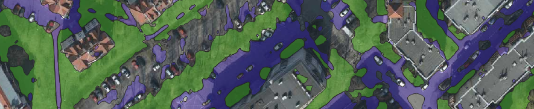

# ZPO Project - Lawn and paving segmentation for single-family houses for QGIS

The purpose of this end-of-semester project was to create a deep learning model for precision geodesy tasks with integration for [QGIS](https://qgis.org/) tool and [Deepness](https://qgis-plugin-deepness.readthedocs.io/en/latest/) plugin

## Instalation
### Verified system versions
 - Ubuntu 22.04
 - Python 3.11

Other requirements are stored in requirements.txt

### Create neptune logger
Add neptune logging by  creating .env file (in root project folder) with following keys:
- neptune_project="project-path-from-neptune"
- neptune_key="abcdefg..."

## Dataset
### Overview
Dataset was created by authors of this project collaborating with the authors of the project [SoLaPAfSFH](https://github.com/2acholsk1/SoLaPAfSFH). With the use of Deepness plugin in QGIS 500 images were generated on the map of Poznan (_Poznan 2022 aerial ortophoto high resolution_ from QGIS plugin [QuickMapServices](https://plugins.qgis.org/plugins/quick_map_services/)) and annotated using [Roboflow](https://roboflow.com/) as a _Semantic Segmentation_ task. 
### Details
Images contain areas of 512x512 pixels with each resolution of 10cm/pixel.
Dataset was exported with train/test split of 0.9/0.1 (later in code train set is divided into actual train set and validation set). Each photo is a pair of actual image with .jpg extension and mask with .png extension. Each photo has a unique name (a pair of photos share the same name, but mask contains "_mask" suffix).
### Classes
0) background (houses, trees, roads, other data that doesn't fit remaining categories)
1) lawn (any green-ish area that is next to a house)
2) paving (any pavement designed for pedestriants and small vehicles like bikes)

## Training
Training was done on multiple different networks avilable via [SMP](https://github.com/qubvel-org/segmentation_models.pytorch) like: unet, unetplusplus, fpn, deeplabv3, deeplabv3plus, pan... They were paired with encoders like (also from [SMP](https://smp.readthedocs.io/en/latest/encoders.html)): resnet, efficientnet, mobileone... We mostly skipped augmentation methods, refraining to enforcing appropiate sizes and normalizing images.

In order to run training:
- ensure date is stored in data/train and data/test folders (with validation set receiving 20% of train data)
- set up .env file as described above
- create virtual env with requirements.txt file and activate
- verify contents of variables/constans.py - those **should not** be modified between runs
- set up parameters in variables/params.py - those **should** be modified between runs to change parameters of training
- run utils/train.py from root folder of project

TODO
## Results
- Example images from dataset (diverse), at least 4 images
- Examples of good and bad predictions, at least 4 images
- Metrics on the test and train dataset

## Trained model in ONNX ready for `Deepness` plugin
In order to export model to ONNX use utils/onnx_export.py. You need to modify checkpoint_path to ensoure proper conversion. Exported model should have all metadata already in it and will appear in root folder of the project.
- model uploaded to XXX and a LINK_HERE

## Demo instructions and video
- a short video of running the model in Deepness (no need for audio), preferably converted to GIF
- what ortophoto to load in QGIS and what physical place to zoom-in. E.g. Poznan 2022 zoomed-in at PUT campus
- showing the results of running the model

## People
Adam Nawrocki & Szymon Zalas
