# ZPO Project - Lawn and paving segmentation for single-family houses for QGIS

The purpose of this end-of-semester project was to create a deep learning model for precision geodesy tasks with integration for [QGIS](https://qgis.org/) tool and [Deepness](https://qgis-plugin-deepness.readthedocs.io/en/latest/) plugin

## Instalation
### Verified system versions
 - Ubuntu 22.04
 - Python 3.11

Other requirements are stored in requirements.txt

### Create neptune logger
Add neptune logging by  creating .env file (in root project folder) with following keys:
- `neptune_project="project-path-from-neptune"`
- `neptune_key="abcdefg..."`

## Dataset
### Overview
Dataset was created by authors of this project collaborating with the authors of the project [SoLaPAfSFH](https://github.com/2acholsk1/SoLaPAfSFH). With the use of Deepness plugin in QGIS 500 images were generated on the map of Poznan (_Poznan 2022 aerial ortophoto high resolution_ from QGIS plugin [QuickMapServices](https://plugins.qgis.org/plugins/quick_map_services/)) and annotated using [Roboflow](https://roboflow.com/) as a _Semantic Segmentation_ task. 
### Details
Images contain areas of 512x512 pixels with each resolution of 10cm/pixel.
Dataset was exported with train/test split of 0.9/0.1 (later in code train set is divided into actual train set and validation set). Each photo is a pair of actual image with .jpg extension and mask with .png extension. Each photo has a unique name (a pair of photos share the same name, but mask contains "_mask" suffix).
### Classes
0) background (houses, trees, roads, other data that doesn't fit remaining categories)
1) lawn (any green-ish area that is next to a house)
2) paving (any pavement designed for pedestriants and small vehicles like bikes)
### Download
A download is possible using [link](https://drive.google.com/file/d/1uWxtacHCtEi_7q6kJ38pOd25-AFzanHp/view?usp=sharing).

## Training
Training was done on multiple different networks avilable via [SMP](https://github.com/qubvel-org/segmentation_models.pytorch) like: unet, unetplusplus, fpn, deeplabv3, deeplabv3plus, pan... They were paired with encoders like (also from [SMP](https://smp.readthedocs.io/en/latest/encoders.html)): resnet, efficientnet, mobileone... We mostly skipped augmentation methods, refraining to enforcing appropiate sizes and normalizing images.

In order to run training:
- ensure date is stored in `data/train` and `data/test` folders (with validation set receiving 20% of train data)
- set up .env file as described above
- create virtual env with `requirements.txt` file and activate
- verify contents of `variables/constans.py` - those **should not** be modified between runs
- set up parameters in `variables/params.py` - those **should** be modified between runs to change parameters of training
- run `utils/train.py` from root folder of project

## Results
### Images
Good predictions            |  Comment
:-------------------------:|:-------------------------:
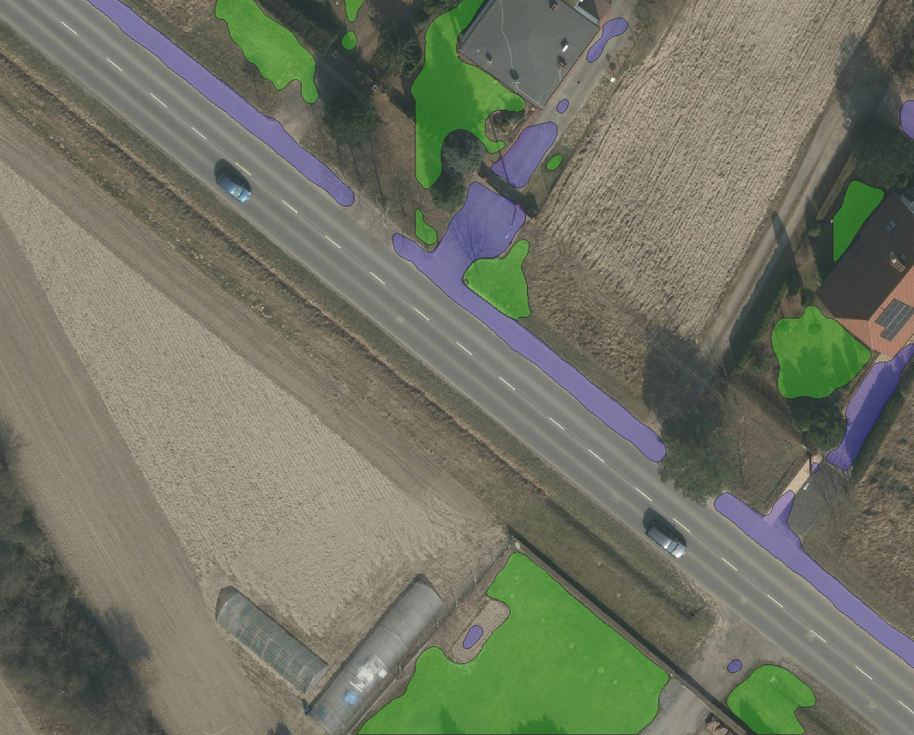  |  Correclty ignores crop fields, mostly correct segments pedestriants walkway without spilling into road, mostly correct segments lawns
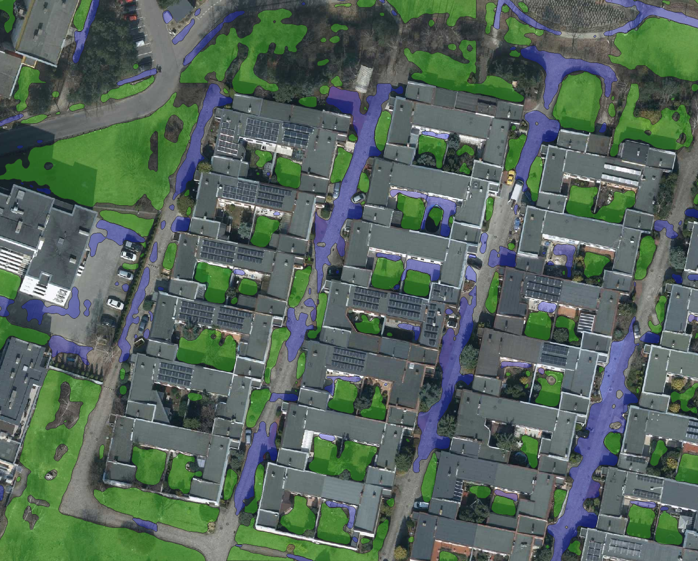)  |  Very good lawn detection, somewhat good paving detection
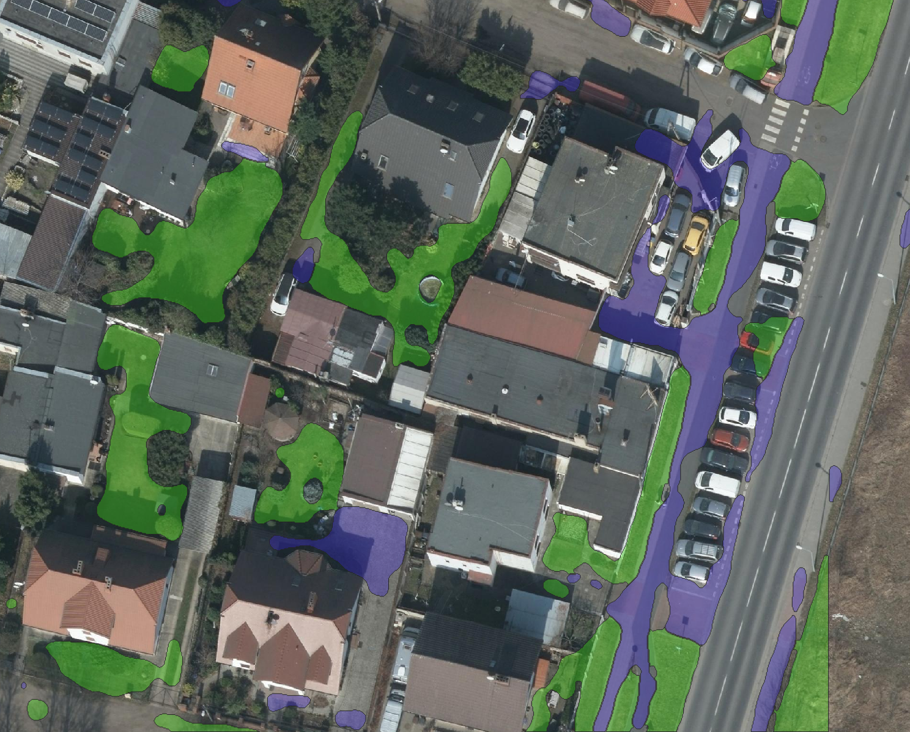)  |  Mostly correct segmentation, small spill to field on the left and missing pedestriants pavement next to it
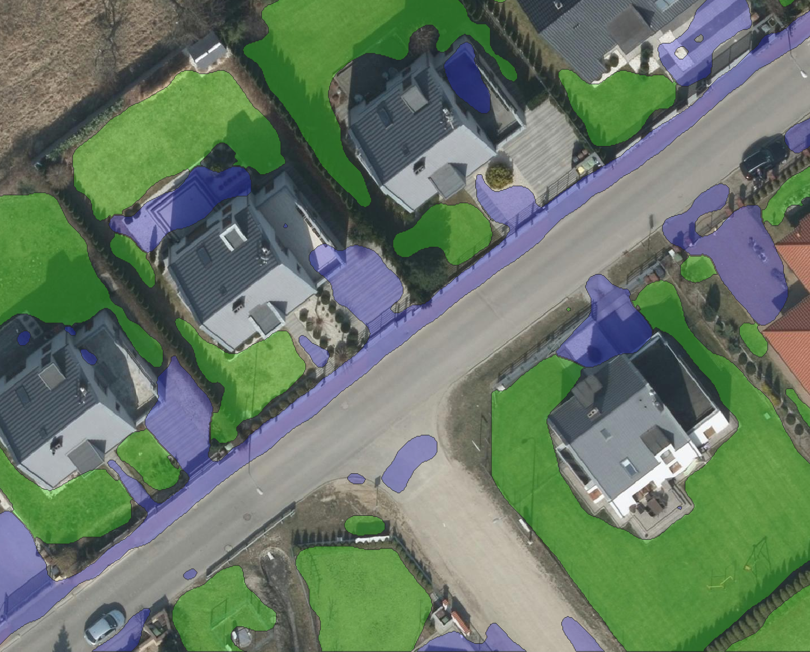  |  Correct segmentation with exception of small gravel road being assigned as paving

Mid predictions            |  Comment
:-------------------------:|:-------------------------:
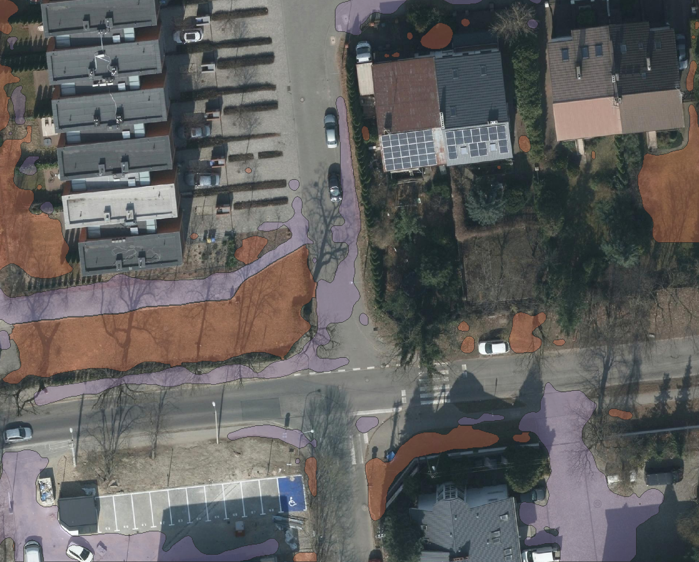  |  Missing some pavement while spilling to road, but skips driveways and correctly assigns lawn
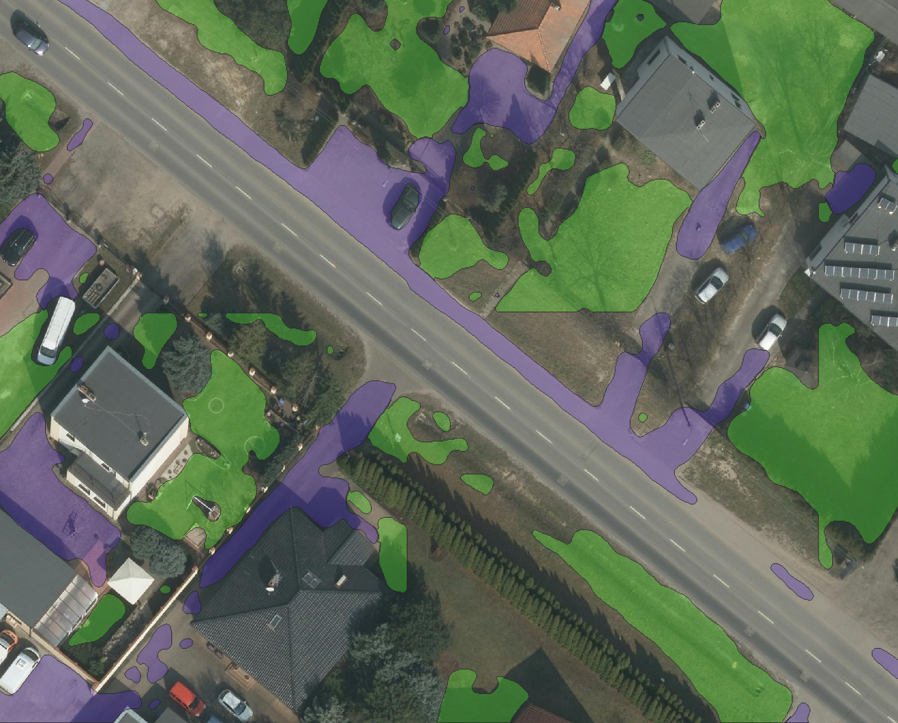)  |  Some pavement and lawn missing, but doesn't spill to road
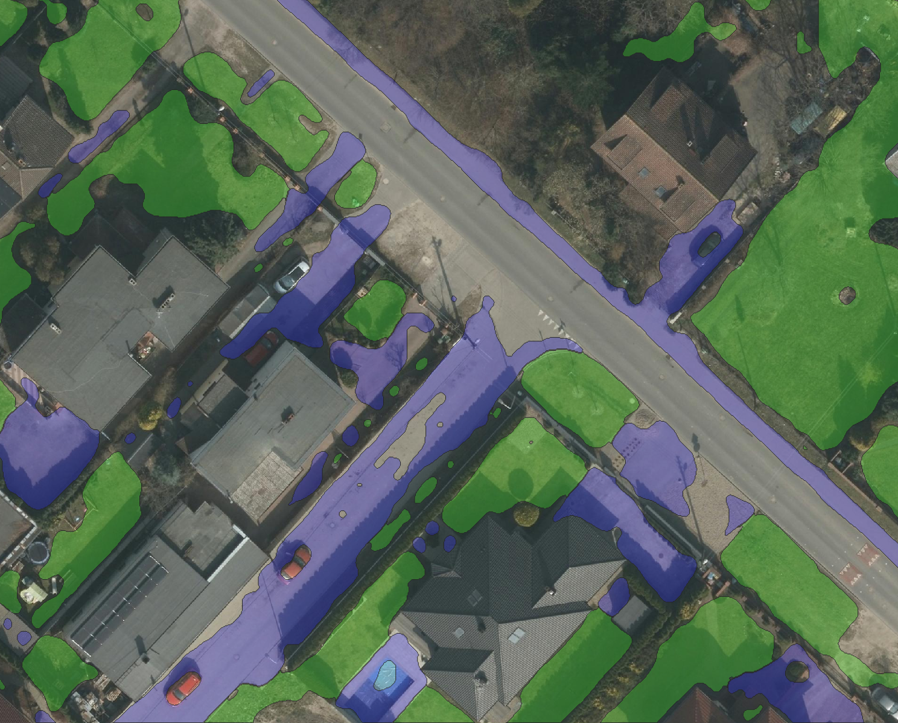)  |  Gravel road is assigned as a pavement
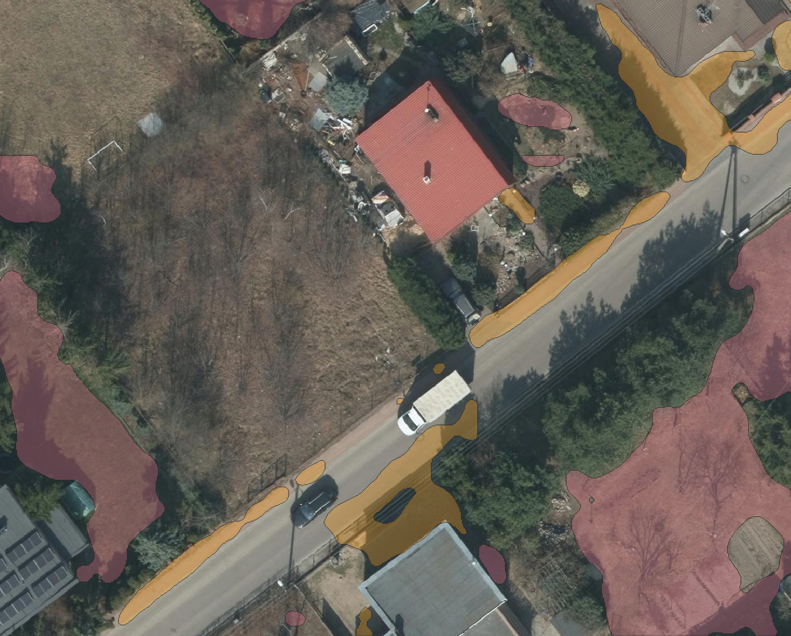  |  Spilling of pavement class to road, pavement has missing fragments, but skips fields of weed and trees (different masks colors on this example)

Bad predictions            |  Comment
:-------------------------:|:-------------------------:
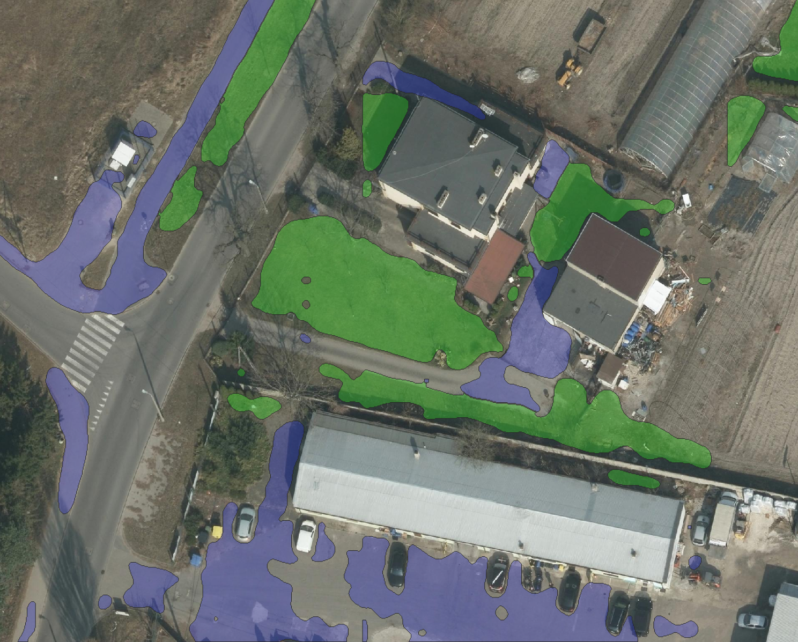  |  Huge area of gravel parking is marked as pavement, while some of the pedestriants pavement is unmarked
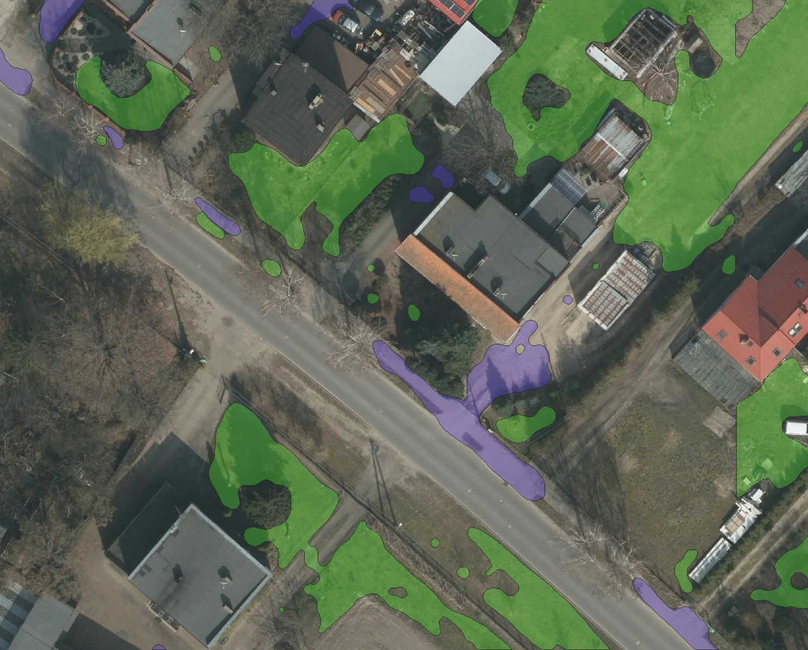)  |  Missing big areas of lawn, pavement with missing areas too
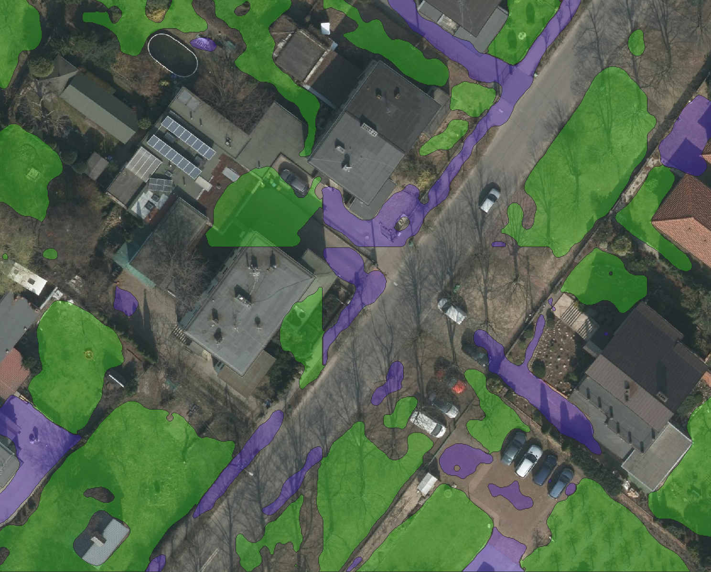)  | In the centre, very weird shapes, spilling to background
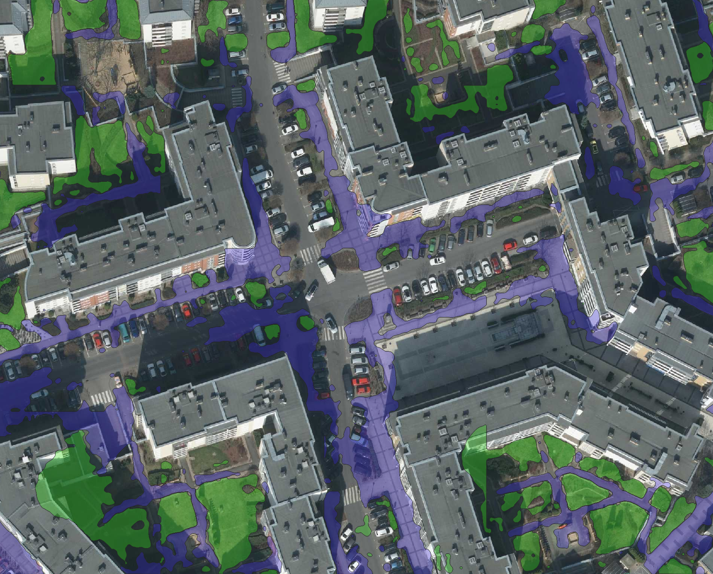  |  While not the task for this segmentation, this example shows that model works badly in city centre where no images were taken and there are less (or even none) single family houses

### Tracked data for selected models from [neptune.ai](neptune.ai)

|hyperparams/model|hyperparams/enc|hyperparams/lr|train_iou (max)   |val_iou (max)     |test_iou (max)     |epoch|
|-----------------|---------------|--------------|------------------|------------------|-------------------|-----|
|unetplusplus     |efficientnet-b6|0.001         |0.9416207671165466|0.5701940059661865|0.5755499005317688 |47.0 |
|unet             |efficientnet-b0|0.001         |0.9027917385101318|0.5618157386779785|0.575025200843811  |53.0 |
|unet             |efficientnet-b6|0.001         |0.9413277506828308|0.5517038702964783|0.5732433199882507 |56.0 |
|deeplabv3        |efficientnet-b3|0.001         |0.9576275944709778|0.5518802404403687|0.564145565032959  |74.0 |
|deeplabv3plus    |efficientnet-b4|0.001         |0.9370303750038147|0.5376648306846619|0.5591127872467041 |42.0 |
|deeplabv3        |mobileone_s0   |0.001         |0.8827603459358215|0.5226636528968811|0.5243299007415771 |38.0 |
|unet             |timm-resnest14d|0.001         |0.8033912181854248|0.5084628462791443|0.5201904773712158 |50.0 |
|unetplusplus     |timm-resnest14d|0.001         |0.8036372661590576|0.5073378086090088|0.5161973834037781 |54.0 |
|unet             |mobileone_s0   |0.001         |0.8989769816398621|0.4465845823287964|0.42361971735954285|37.0 |

## Trained model in ONNX ready for `Deepness` plugin
In order to export model to ONNX use `utils/onnx_export.py`. You need to modify `checkpoint_path` to ensure proper conversion. Exported model should have all metadata already in it and will appear in root folder of the project.
While using model ensure that resolution remains at 10cm/px.
Exported models are avilable in the root folder of project.

Selected ONNX models can be downloaded from [link](https://drive.google.com/file/d/1OQCPB2GEueLkcQ2xIJ1Ji8A45A4fJt9w/view?usp=sharing).

## Demo instructions and video
- Select map in _QGIS_ and activate _Deepness_ plugin
- Zoom in on region of intrest
- Select model in `onnx` format
- Load default parameters
- Ensure that resolution remains at 10cm/px
- Hit run and wait for results

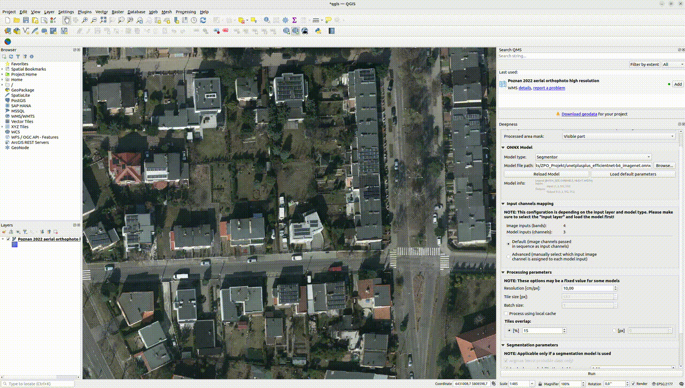

## People
[Adam Nawrocki](https://github.com/AdamTheStudent) & [Szymon Zalas](https://github.com/szymonzalas)
